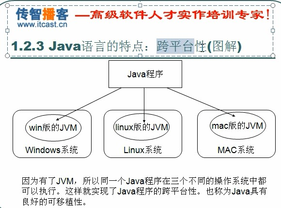

- [一、Java语言概述（SE01）](#%e4%b8%80java%e8%af%ad%e8%a8%80%e6%a6%82%e8%bf%b0se01)
  - [1.1 java语言的三种技术架构](#11-java%e8%af%ad%e8%a8%80%e7%9a%84%e4%b8%89%e7%a7%8d%e6%8a%80%e6%9c%af%e6%9e%b6%e6%9e%84)
  - [1.2 java语言的跨平台原理](#12-java%e8%af%ad%e8%a8%80%e7%9a%84%e8%b7%a8%e5%b9%b3%e5%8f%b0%e5%8e%9f%e7%90%86)
  - [1.3 java运行环境JRE,开发环境JDK](#13-java%e8%bf%90%e8%a1%8c%e7%8e%af%e5%a2%83jre%e5%bc%80%e5%8f%91%e7%8e%af%e5%a2%83jdk)
  - [1.4 JDK的下载与安装](#14-jdk%e7%9a%84%e4%b8%8b%e8%bd%bd%e4%b8%8e%e5%ae%89%e8%a3%85)
  - [1.5 JAVA的GUI、CLI](#15-java%e7%9a%84guicli)
  - [1.6 命令行命令简介（注意help的应用）](#16-%e5%91%bd%e4%bb%a4%e8%a1%8c%e5%91%bd%e4%bb%a4%e7%ae%80%e4%bb%8b%e6%b3%a8%e6%84%8fhelp%e7%9a%84%e5%ba%94%e7%94%a8)
  - [1.7-1.9 Java环境变量配置](#17-19-java%e7%8e%af%e5%a2%83%e5%8f%98%e9%87%8f%e9%85%8d%e7%bd%ae)
  - [1.10](#110)
- [二、Java语言基础组成（SE02-SE06）](#%e4%ba%8cjava%e8%af%ad%e8%a8%80%e5%9f%ba%e7%a1%80%e7%bb%84%e6%88%90se02-se06)
  - [2.1关键字](#21%e5%85%b3%e9%94%ae%e5%ad%97)
  - [2.2标识符](#22%e6%a0%87%e8%af%86%e7%ac%a6)
  - [2.3注释](#23%e6%b3%a8%e9%87%8a)
    - [2.3.1 注释的分类：](#231-%e6%b3%a8%e9%87%8a%e7%9a%84%e5%88%86%e7%b1%bb)
    - [2.3.2 注释的作用：](#232-%e6%b3%a8%e9%87%8a%e7%9a%84%e4%bd%9c%e7%94%a8)
    - [2.3.3 注释的模板：](#233-%e6%b3%a8%e9%87%8a%e7%9a%84%e6%a8%a1%e6%9d%bf)
    - [2.3.4 类型转换（数值型之间）](#234-%e7%b1%bb%e5%9e%8b%e8%bd%ac%e6%8d%a2%e6%95%b0%e5%80%bc%e5%9e%8b%e4%b9%8b%e9%97%b4)
  - [2.4常量与变量](#24%e5%b8%b8%e9%87%8f%e4%b8%8e%e5%8f%98%e9%87%8f)
  - [2.5运算符](#25%e8%bf%90%e7%ae%97%e7%ac%a6)
    - [2.5.1 boolean型：](#251-boolean%e5%9e%8b)
    - [2.5.2 逻辑运算符](#252-%e9%80%bb%e8%be%91%e8%bf%90%e7%ae%97%e7%ac%a6)
    - [2.5.3 双与（&&）双或（||），单与（&）单或（|）](#253-%e5%8f%8c%e4%b8%8e%e5%8f%8c%e6%88%96%e5%8d%95%e4%b8%8e%e5%8d%95%e6%88%96)
    - [2.5.4 左移](#254-%e5%b7%a6%e7%a7%bb)
    - [2.5.5 右移](#255-%e5%8f%b3%e7%a7%bb)
    - [2.5.6 三元运算符](#256-%e4%b8%89%e5%85%83%e8%bf%90%e7%ae%97%e7%ac%a6)
  - [2.6语句(SE04)](#26%e8%af%ad%e5%8f%a5se04)
  - [2.7函数(SE04)](#27%e5%87%bd%e6%95%b0se04)
    - [2.7.1 函数重载](#271-%e5%87%bd%e6%95%b0%e9%87%8d%e8%bd%bd)
    - [2.7.2 函数内存加载](#272-%e5%87%bd%e6%95%b0%e5%86%85%e5%ad%98%e5%8a%a0%e8%bd%bd)
  - [2.8数组(SE04-SE06)](#28%e6%95%b0%e7%bb%84se04-se06)
    - [2.8.1 内存的划分](#281-%e5%86%85%e5%ad%98%e7%9a%84%e5%88%92%e5%88%86)
    - [2.8.2 数组的应用-进制转换](#282-%e6%95%b0%e7%bb%84%e7%9a%84%e5%ba%94%e7%94%a8-%e8%bf%9b%e5%88%b6%e8%bd%ac%e6%8d%a2)

# 一、Java语言概述（SE01）

## 1.1 java语言的三种技术架构


## 1.2 java语言的跨平台原理
> 任何系统运行程序都要解析（先读读，读懂再执行。），Windows是用c和c++写的，所以可以解析c和c++写的东西，Java写的程序要在他上面运行，需要用一个解析器-虚拟机（JVM），用来解析成对应平台上可以识别的，虚拟机一方面可以和平台沟通，另一方面可以和java沟通。
虚拟机就是虚拟出一台机器，用于解析程序，解析java的虚拟机叫java虚拟机-JVM，虚拟机不跨平台，必须根据OS装对应的版本，让脏活累活给虚拟机干。


## 1.3 java运行环境JRE,开发环境JDK
> 使用任何语言，要运行的话必须搭建运行环境（JRE:Java Runtime Environment），要开发该语言的软件，还必须有他对应的开发工具包(JDK:Java Development Kit)。
运行Java-------JRE: JVM + 核心类库	        
开发Java-----JDK:JRE+java的开发工具


## 1.4 JDK的下载与安装
> JDK的安装目录拷到U盘也可以用，所以不要装到C盘

## 1.5 JAVA的GUI、CLI
> 图像化界面是将命令行封装后使用鼠标这些操作。

## 1.6 命令行命令简介（注意help的应用）


## 1.7-1.9 Java环境变量配置

> 使得java在其他非安装目录下，用cmd也可以打开，这种情况下可以将java的安装路径放到系统的环境变量下系统变量（系统应用程序的路径）。
这是因为如果当前目录下，没有找到可执行（.exe）程序，那么就会在系统路径下找，如果找不到，就报错。所以为了让系统帮我们找，我们可以事前把Java的bin的路径添加到环境变量的系统变量下。重启cmd,验证。
*	下载JDK并安装
*	配环境变量:
**方法一：在path中直接添加-------风险大**
**方法二：新建环境变量：用变量添加 ----风险小，易修改**
* cmd中验证：javac  -version

## 1.10 
* javac : 对Java编译,javac启动了JDK中的编译程序
* java: 运行java的class，启动虚拟机，到指定的位置，找指定class，加载到内存，找主函数，作为入后，开始执行。


# 二、Java语言基础组成（SE02-SE06）

## 2.1关键字
* 关键字必须都是小写
* 语言已经定义好的
* 类名最好大写


## 2.2标识符
* 程序自定义的名称
* 字母，0-9，_,& 组成
* 合法话的规则：
    * 1.数字不可以开头
    * 2.不可以使用关键字
* java严格区分大小写
* 要命名有意义

## 2.3注释
### 2.3.1 注释的分类：
* 单行注释： // 
* 多行注释：/* */
* 文档注释：/** 该部分文档可以用工具javadoc.java提取 */

### 2.3.2 注释的作用：
* 注释用于代码作用的阐述，代码是思想的体现
* 用于测试，排除bug的位置

### 2.3.3 注释的模板：
* 先写多行注释
* 需求、思路、步骤
### 2.3.4 类型转换（数值型之间）
* 隐式类型转换（把小的放到大的中）
* 显示类型转换（把大的放到小的中）
```java
/* 多行注释

需求：练习一个hello world程序

思路：
1. 定义一个类
2. 定义一个主函数
3. 因为要演示，故还要输出语句

步骤：
1. 用class关键字完成类的定义，并起有意义的变量名
2. 主函数：public
3. 使用输出语句：System.out.println("Hello world");
*/
class Demo 
{
    // 定义一个主函数，保证程序的独立运行
    public static void main(String[] args)
    {
        System.out.println("Hello world"); // 打印字符串到控制台上
    } 
}
```

## 2.4常量与变量


## 2.5运算符


### 2.5.1 boolean型：
* 比较运算符运算完肯定有结果,是boolean型： True,False。

### 2.5.2 逻辑运算符
* 常用于连接连接两个boolean型表达式。
* 逻辑运算符的**单与、单或、异或**也可以作为位运算符，运算前将两侧的数字先 变为二进制
* A异或（位运算）B两次，结果还是A，用于加密

### 2.5.3 双与（&&）双或（||），单与（&）单或（|）
* 双与（&&）双或（||）有短路的效果，最终运算结果和单与单或一样，但是双与双或在前面可以推出结果，后面就不算了，更加高效。
### 2.5.4 左移
* A左移B位就是A = Ax(2^B)

### 2.5.5 右移
* A右移B位就是A = A\\(2^B)
* 无符号右移">>>"：高位用0补
* 有符号右移">>"：高位用原来高位数字补

### 2.5.6 三元运算符
* 找两个数的较大的存下来,是if-else的简写格式

## 2.6语句(SE04)


> **局部代码块**
  里面的变量在括号外面就已经释放了，是局部变量，可以节省内存空间。

## 2.7函数(SE04)
### 2.7.1 函数重载
### 2.7.2 函数内存加载


## 2.8数组(SE04-SE06)


### 2.8.1 内存的划分
* 寄存器
* 本地方法区
* 方法区
* 栈内存
    * 存储都都是局部变量（作用域内有效，随时释放）
* 堆内存
    * 存储实体，都是数组和对象
    * 数组就是对象，凡是new就在堆里面
    * 每一个实体都有首地址
    * 堆内存中每个变量都有默认始化值，类型不同，初始化都值不同
    * 堆有垃圾回收机制

### 2.8.2 数组的应用-进制转换

> **思路**：
>* java中int是4个字节，8*4共32bit，在电脑中用二进制存储
>* 二进制是用8位表示1位十进制数
>* 十六进制用4位表示一位
>* 所以将二进制4位4位划分，并将结果与15进行位与，就是该位置对应的十六进制的值（java中int最多转化的十六进制有8位）。

>**难点：**
>* **二进制与十六进制从10开始数字和字符对应关系：**
十六进制：1，2，3，4，5，6，7，8，9，A,B,C,D,E,F
 二进制： 1，2，3，4，5，6，7，8，9，10,11,12,13,14,15
>* **方法一**：用10作为基准，通过ASCII码+强制类型转换
>* **方法二（查表法）**：通过利用数组，将元素存在数组中，利用角标天然对应关系
 
>**倒序输出转化结果**
 将每四位转换一个的结果存在栈（可以存不同类型的元素）中，等转换结束后，再依次出栈。
 


``` java 
// 2进制转16进制
import java.util.Stack;

class ArrayToHex
{
    public static void main(String[] args) {
        int num = 60;
        toHexInASCII(num);
        toHexInTable(num);
    }

    public static void toHexInASCII(int num)
    {// 方法一：用ASCII编码 + 栈存结果
        System.out.println("The num " + num + " transfer to Hex using ASCII is :" ); 
        int temp = 0;
        char numHex;
        Stack result = new Stack();
        //System.out.println("\n The result of push:");
        for(int i=0;i<8;i++){
            while(num != 0){
                temp = num & 15;
                if (temp>9){
                    numHex = (char)(temp - 10 + 'A');
                    //System.out.print("\t" + numHex);
                    result.push(numHex);
                }
                else {
                    //System.out.print("\t" + temp);
                    result.push(temp);
                }
                //System.out.print(numHex);
                num = num >>> 4;                
            }
        }
        //System.out.println("\n\n The result of pop:");
        
        while(!result.empty()){
           
            System.out.print( result.peek());
            result.pop(); // 一定要出栈，否则死循环
            //char a =(char) result.pop();
            //System.out.print("\t" + a);
        }
    }// end toHexInASCII

    public static void toHexInTable (int num) {
        //方法二：用查表法算2进制到16进制 + 数组存结果
        System.out.println("\n The num " + num + " transfer to Hex using Table is :" ); 
        char[] table = {'1','2','3','4','5','6',
                        '7','8','9','A','B','C',
                        'D','E','F'};
        char[] result = new char[8];
        int pos = 0;
        for(int x=0; x<8; x++){
            while (num != 0){
                int temp = num & 15;
                result[pos++] = table[temp-1]; 
                num = num>>>4;
            }
        }
        //System.out.println("\n result2"); 
        for (int x=(result.length-1); x>=0;x--){
            // 倒序打印数组元素
            System.out.print(result[x]);
        }
    }
}
```
