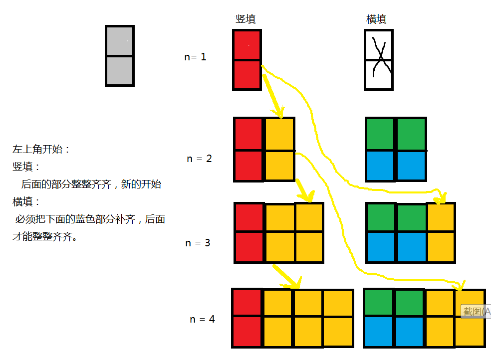

- [剑指offer练习题](#%e5%89%91%e6%8c%87offer%e7%bb%83%e4%b9%a0%e9%a2%98)
  - [说明：](#%e8%af%b4%e6%98%8e)
  - [一. 数组](#%e4%b8%80-%e6%95%b0%e7%bb%84)
    - [T1. 二维数组中的查找（M4.P44）](#t1-%e4%ba%8c%e7%bb%b4%e6%95%b0%e7%bb%84%e4%b8%ad%e7%9a%84%e6%9f%a5%e6%89%bem4p44)
  - [二. 字符串](#%e4%ba%8c-%e5%ad%97%e7%ac%a6%e4%b8%b2)
    - [T2. 替换空格（M5.P51）](#t2-%e6%9b%bf%e6%8d%a2%e7%a9%ba%e6%a0%bcm5p51)
  - [三. 链表](#%e4%b8%89-%e9%93%be%e8%a1%a8)
    - [T3. 从尾到头打印链表（M6.P58）](#t3-%e4%bb%8e%e5%b0%be%e5%88%b0%e5%a4%b4%e6%89%93%e5%8d%b0%e9%93%be%e8%a1%a8m6p58)
  - [四. 树](#%e5%9b%9b-%e6%a0%91)
    - [T4. 重建二叉树（M7.P62）](#t4-%e9%87%8d%e5%bb%ba%e4%ba%8c%e5%8f%89%e6%a0%91m7p62)
  - [五. 栈和队列](#%e4%ba%94-%e6%a0%88%e5%92%8c%e9%98%9f%e5%88%97)
    - [T5. 用两个栈实现队列（M9.P68）](#t5-%e7%94%a8%e4%b8%a4%e4%b8%aa%e6%a0%88%e5%ae%9e%e7%8e%b0%e9%98%9f%e5%88%97m9p68)
  - [六. 查找和排序](#%e5%85%ad-%e6%9f%a5%e6%89%be%e5%92%8c%e6%8e%92%e5%ba%8f)
    - [T6. 旋转数组的最小数字（M11.P82）](#t6-%e6%97%8b%e8%bd%ac%e6%95%b0%e7%bb%84%e7%9a%84%e6%9c%80%e5%b0%8f%e6%95%b0%e5%ad%97m11p82)
  - [七. 递归和循环](#%e4%b8%83-%e9%80%92%e5%bd%92%e5%92%8c%e5%be%aa%e7%8e%af)
    - [T7. 斐波拉切数列（M10.P74）](#t7-%e6%96%90%e6%b3%a2%e6%8b%89%e5%88%87%e6%95%b0%e5%88%97m10p74)
    - [T8. 跳台阶（M10.P74）](#t8-%e8%b7%b3%e5%8f%b0%e9%98%b6m10p74)
    - [T9. 变态跳台阶（M10.P74）](#t9-%e5%8f%98%e6%80%81%e8%b7%b3%e5%8f%b0%e9%98%b6m10p74)
    - [T10. 矩形覆盖（M10.P74）](#t10-%e7%9f%a9%e5%bd%a2%e8%a6%86%e7%9b%96m10p74)
  - [八. 位运算](#%e5%85%ab-%e4%bd%8d%e8%bf%90%e7%ae%97)
    - [T11. 二进制中1的个数（M15.P100）](#t11-%e4%ba%8c%e8%bf%9b%e5%88%b6%e4%b8%ad1%e7%9a%84%e4%b8%aa%e6%95%b0m15p100)
  - [九. 代码的完整性](#%e4%b9%9d-%e4%bb%a3%e7%a0%81%e7%9a%84%e5%ae%8c%e6%95%b4%e6%80%a7)
    - [T12. 数值的整数次方（M16.P110）](#t12-%e6%95%b0%e5%80%bc%e7%9a%84%e6%95%b4%e6%95%b0%e6%ac%a1%e6%96%b9m16p110)
    - [T13. 调整数组顺序使奇数位于偶数前面（M21.P129）](#t13-%e8%b0%83%e6%95%b4%e6%95%b0%e7%bb%84%e9%a1%ba%e5%ba%8f%e4%bd%bf%e5%a5%87%e6%95%b0%e4%bd%8d%e4%ba%8e%e5%81%b6%e6%95%b0%e5%89%8d%e9%9d%a2m21p129)
  - [十. 代码的鲁棒性](#%e5%8d%81-%e4%bb%a3%e7%a0%81%e7%9a%84%e9%b2%81%e6%a3%92%e6%80%a7)
    - [T14. 链表中倒数第K个结点（M22.P134）](#t14-%e9%93%be%e8%a1%a8%e4%b8%ad%e5%80%92%e6%95%b0%e7%ac%ack%e4%b8%aa%e7%bb%93%e7%82%b9m22p134)
    - [T15. 反转链表（M24.P142）](#t15-%e5%8f%8d%e8%bd%ac%e9%93%be%e8%a1%a8m24p142)
    - [T16. 合并两个排序的链表（M25.P145）](#t16-%e5%90%88%e5%b9%b6%e4%b8%a4%e4%b8%aa%e6%8e%92%e5%ba%8f%e7%9a%84%e9%93%be%e8%a1%a8m25p145)
    - [T17. 树的子结构（M26.P148）](#t17-%e6%a0%91%e7%9a%84%e5%ad%90%e7%bb%93%e6%9e%84m26p148)
  - [十一. 面试思路](#%e5%8d%81%e4%b8%80-%e9%9d%a2%e8%af%95%e6%80%9d%e8%b7%af)
    - [T18. 二叉树的镜像（M27.P157）](#t18-%e4%ba%8c%e5%8f%89%e6%a0%91%e7%9a%84%e9%95%9c%e5%83%8fm27p157)
  - [十二. 画图让抽象形象化](#%e5%8d%81%e4%ba%8c-%e7%94%bb%e5%9b%be%e8%ae%a9%e6%8a%bd%e8%b1%a1%e5%bd%a2%e8%b1%a1%e5%8c%96)
    - [T19. 顺时针打印矩阵（M29.P161）](#t19-%e9%a1%ba%e6%97%b6%e9%92%88%e6%89%93%e5%8d%b0%e7%9f%a9%e9%98%b5m29p161)
  - [十三. 举例让抽象具体化](#%e5%8d%81%e4%b8%89-%e4%b8%be%e4%be%8b%e8%ae%a9%e6%8a%bd%e8%b1%a1%e5%85%b7%e4%bd%93%e5%8c%96)
    - [T20. 包含min函数的栈（M30.P165）](#t20-%e5%8c%85%e5%90%abmin%e5%87%bd%e6%95%b0%e7%9a%84%e6%a0%88m30p165)


# 剑指offer练习题

## 说明：
> * 这里的顺序是牛客网上的
> * 书上的顺序注在括号中
> * 每题尽量从：考点、思路、难点、技巧、思考几个维度分析，总结。
> * 测试在main函数zhong中，实现在下面函数中。

## 一. 数组
### T1. 二维数组中的查找（M4.P44）
> **题目描述**
在一个二维数组中（每个一维数组的长度相同），每一行都按照从左到右递增的顺序排序，每一列都按照从上到下递增的顺序排序。请完成一个函数，输入这样的一个二维数组和一个整数，判断数组中是否含有该整数。

> **考点：**
> * 求一个二维数组的行数，列数
> * 剔除一个二维数组的某行，或某列: 
 --column;
 ++row;
> * 二维矩阵的角标从0开始

> ****思路：****
> **方法一：暴力法O(n^2)**
> **方法二：边找边删除法**
> * 每次取数组固定位置：右上角的元素
> * 将其与目标数比较，相同输出，不同剔除一行或者一列
> * 重复1-2直到找到元素或遍历完整个数组
        
> **难点：**
> * 将找不到目标时查右，下元素（有重叠元素）转化为找右或下
> * boolean类型的函数，设置状态变量：boolean found = false;
> *  二维数组“假”删除某行或者某列
 --column;
 ++row;
> * 二维数组不为空的判定条件：matrix != null && rows > 0 && columns > 0

> **技巧：**
> * 用row,column的变化，依次剔除不符合条件的行列，而没用真正用一个临时二维数组存每次剔除完行列的新数组。

> **代码实现：**
```java
class T1ArraySearch {

    public static void main(String[] args) {

        // 定义一个整型数组:3行4列
        int matrix[][] = new int[3][4];

        // 获取行数---3行
        int lenX = matrix.length; // 3
        // 获取列数---4列
        int lenY = matrix[0].length; // 4

        System.out.println("\nlenX = " + lenX + "  lenY = " + lenY + '\n');

        int num = 0;
        for (int x = 0; x < lenX; x++) {
            for (int y = 0; y < lenY; y++) {
                matrix[x][y] = num++;
            }
        }

        for (int x = 0; x < lenX; x++) {
            for (int y = 0; y < lenY; y++) {
                System.out.print(matrix[x][y] + " ");
            }
            System.out.println();
        }
        // test
        boolean a = Find(5,matrix);
        System.out.println(a);  

    }

    public static boolean Find(int target, int[][] matrix) {
        /***思路：**
        1、 每次取数组固定位置：右上角的元素
        2、将其与目标数比较，相同输出，不同剔除一行或者一列
        3、重复1-2直到找到元素或遍历完整个数组
        */
        boolean found = false;
        // 获取行数---3行
        int rows = matrix.length;
        // 获取列数---4列
        int columns = matrix[0].length;

        if (matrix != null && rows > 0 && columns > 0) {// 二维矩阵不为空
            // 右上角的元素坐标：row,column
            int row = 0;
            int column = columns - 1;
            while (row < rows && column >= 0) {
                // 还没遍历完时
                if (matrix[row][column] == target) {
                    // 右上角和target正好相等就结束寻找
                    found = true;
                    return found;
                    // break;
                } else if (matrix[row][column] > target) {
                    // 右上角>target,剔除matrix最后一列
                    --column;
                } else {
                    // 右上角<target,剔除matrix上面一行
                    ++row;
                }
            }
            found =  false;
            return found;

        }
        System.out.println("matrix is wrong!");
        found =  false;
        return found;
    }
}
```


## 二. 字符串
### T2. 替换空格（M5.P51）
> **题目描述**
请实现一个函数，将一个字符串中的每个空格替换成“%20”。例如，当字符串为We Are Happy.则经过替换之后的字符串为We%20Are%20Happy。

> **考点：**
> 1. java中字符串,尾部没有"\0"
> 2. java 字符串的常用方法 https://www.runoob.com/java/java-stringbuffer.html
> 3. String类：创建后不可修改,适用于少量的字符串操作的情况
> 4. StringBuffer & StringBuilder 类
> * **相同点：**
> 其对象能够被多次的修改，并且不产生新的未使用对象。
> * **不同点：**
> (1). StringBuilder（常用）的方法不是线程安全的（不能同步访问），但速度快,适用于单线程下在字符缓冲区进行大量操作的情况
> (2). StringBuffer线程安全的，但是慢,适用多线程下在字符缓冲区进行大量操作的情况
> (3). 强调速度：用StringBuilder，有线程隐患：用StringBuffer

> ****思路：****
> 1. 看清要求：在原始字符串上操作还是可以使用新的中介变量
> 2. 方案一：原始字符串上操作，且尾部有足够的空间
> * 从前往后替换：思路简单易懂，但是要多次移动，效率低。
> * 从后往前替换：要先计算需要增加多少，但是效率高。
> 3. 方案二：可以使用中间变量存一下

> **难点：**
> 1. 判断StringBuffer型字符串中是否有空格
> * 返回字符串序列中指定索引处的 char 值，记作temp
> * char类型可以直接跟int类型进行比较.
> * char类型的空格换成int是32.
> 2. 计算完替换完的长度，一定要设置其长度为newLength，虽然newLength仍然小于str.capacity()，但是容量没用完的地方可能啥都有，必须清空给新元素用
``` java
        int length = str.length();          // 返回长度：所含字符个数。:13
        int originalLength= str.capacity(); // 返回当前容量: 字符串实际大小:29
        int newLength = 0;    
        newLength = length + 2*numBlack; // 17,每出现一个空格，字符串替换之后长度增加2
        str.setLength(newLength);   // 原来放teng13个元素，现在要放17个，必须腾出来
```


> **技巧**:
> 1. '++','--'的应用
``` java 
        // 定义index指向原始字符串的末尾和替换之后的字符串的末尾，从后往前替换
        while(originalIndex>=0){
            if(str.charAt(originalIndex) == ' '){
                str.setCharAt(newIndex--, '0');
                str.setCharAt(newIndex--, '2');
                str.setCharAt(newIndex--, '%');
            }
            else{
                str.setCharAt(newIndex--, str.charAt(originalIndex));
            }
            --originalIndex ; 
        }
```
> 2. 牛客网加了这部分判断报错：只能通过50%case，注释掉
``` java
        // 牛客网加了这部分判断报错：只能通过50%case，注释掉
        if(str == null || length==0){ 
          // str为空为非法输入
            String message = "wrong input";
            return message;
        }
        // 牛客网加了这部分判断报错：只能通过50%case，注释掉
        if (newLength > originalLength){
          // 替换后长度超出容量，报错
            String message = "wrong input";
            return message;
        }
```
> 思考：
> 1. 掌握常见类及其常见方法，可以节省很多无用功
> 2. 注意不同类型之间的运算，如比较（str.charAt(originalIndex) == ' '），如函数要求返回值为String,就要符合要求的返回，（result = str.toString();）

> 代码实现：
```java
/*请实现一个函数:
将一个字符串中的每个空格替换成“%20”。
例如，当字符串为We Are Happy.
则经过替换之后的字符串为We%20Are%20Happy。
*/
class T2_ReplaceBlack{
    public static void main(String[] args) {
        StringBuffer str = new StringBuffer("We Are Happy.");
        System.out.println(replaceSpace(str));
        /* ======== test ===========
        for (int x=0; x<str.length();x++ ){
            System.out.print(str.charAt(x));
        }
        int length = str.length();          // 返回长度（字符数）:字符串的实际长度
        int originalLength= str.capacity(); // 返回当前容量: 字符串所占容器的总大小
        System.out.println("\nlength = " + length);
        System.out.println("originalLength = " + originalLength); 

        StringBuffer str2 = new StringBuffer(); // 默认长度是16
        System.out.println(str2.length());
        System.out.println(str2.capacity());
        */
    
    }
    /*
    
    */
    public static String replaceSpace(StringBuffer str) {
        /* **思路：**
        1、 遍历字符串，确定空格数，从而算出新的str的大小
        2、 从后往前，依次替换空格为%20
        3、 返回结果
        */
        int length = str.length();          // 返回长度：所含字符个数。:13
        int originalLength= str.capacity(); // 返回当前容量: 字符串实际大小:29
        int newLength = 0;
        String result;
        // 牛客网加了这部分判断报错：只能通过50%case，注释掉
        if(str == null || length==0){
            String message = "wrong input";
            return message;
        }

        // 1.统计空格数量
        int numBlack = 0;
        for (int x=0; x<str.length(); x++){
            if (str.charAt(x) == ' '){
                //  char类型的空格换成int是32.//   char类型可以直接跟int类型进行比较.
                numBlack++;
            }
        }
        // 2. 计算新的字符串的长度
        newLength = length + 2*numBlack; // 17,每出现一个空格，字符串替换之后长度增加2
        // 牛客网加了这部分判断报错：只能通过50%case，注释掉
        if (newLength > originalLength){
            String message = "wrong input";
            return message;
        }
        System.out.println(str.length());
        str.setLength(newLength);   // 原来放teng13个元素，现在要放17个，必须腾出来
        System.out.println(str.length());       
        // 3. 定义index指向原始字符串的末尾和替换之后的字符串的末尾，从后往前替换
        int originalIndex = length-1 ;
        int newIndex = newLength-1;

        while(originalIndex>=0){
            if(str.charAt(originalIndex) == ' '){
                str.setCharAt(newIndex--, '0');
                str.setCharAt(newIndex--, '2');
                str.setCharAt(newIndex--, '%');
            }
            else{
                str.setCharAt(newIndex--, str.charAt(originalIndex));
            }
            --originalIndex ; 
        }
        result = str.toString();
        return result ;
    }
}
```

## 三. 链表
### T3. 从尾到头打印链表（M6.P58）
> 考点：
> * **Java 链表inikedList**：
> 每个链表都包括一个**LinikedList对象**和许多**Node对象**。增删是以结点Node为基础的。
> 
> * **LinkedList对象：**
>    通常包含头和尾节点的引用，分别指向链表的第一个节点和最后一个节点。
> * **节点对象**
>  1. 通常包含数据部分data，以及对上一个节点的引用prev和下一个节点的引用next
>  2. 单向链表：只有下一个节点的引用
>  3. 双向链表：两个节点的引用都有的
>  4. next值为null则说明是链表的结尾
> * **元素查找**
> 如果想找到某个节点，我们必须从第一个节点开始遍历，不断通过next找到下一个节点，直到找到所需要的。
> * **应用**
> 栈和队列都是ADT，可以用数组来实现，也可以用链表实现。
> **思路：**
```java
        /* ============= 法一：改变链表节点指针，使之反向 ===============
            1. 缺点：修改了原来链表的结构
            2. 优点：简单易行。
        */
        // code1
        
        
        /* ============= 法二：利用栈基于循环输出元素 。==================
            1. 栈先入后出，符合题意，遍历链表元素，存在栈中，再输出栈中元素
            2. 优点：无序考虑栈溢出。
            3. 缺点：涉及到链表，栈，代码较为复杂
        */ 
        
        /* ============= 法三：使用迭代（迭代本质为栈结构）=================
            1. 优点：代码简短
            2. 缺点：链表长时，调用层级很深，导致函数栈溢出。
        
        */ 
        
        /* ============= 法四：遍历链表元素，用中间列表保存，逆序打印 ========
            1. 优点：代码简短
            2. 缺点：链表长时，调用层级很深，导致函数栈溢出。
        */ 
```


## 四. 树
### T4. 重建二叉树（M7.P62）
> **题目描述**
输入某二叉树的前序遍历和中序遍历的结果，请重建出该二叉树。假设输入的前序遍历和中序遍历的结果中都不含重复的数字。例如输入前序遍历序列{1,2,4,7,3,5,6,8}和中序遍历序列{4,7,2,1,5,3,8,6}，则重建二叉树并返回。
> 考点：
> * 二叉树的遍历方式理解
> * 递归思想
> * 自定义数据结构的应用（TreeNode.java）
> **思路：**
> * 二叉树前序遍历确定树的根节点值
> * 二叉树中序遍历确定树的根节点位置，以及左右子树的结点值
> * 递归上面两步，直到构建出二叉树


## 五. 栈和队列
### T5. 用两个栈实现队列（M9.P68）
> **题目要求：**
> 用两个栈来实现一个队列，完成队列的Push和Pop操作。 队列中的元素为int类型。

> 考点：
> **Java 自定义类的使用**
> * 一个类要单独存为一个.java文件
> * 测试类中含main方法
> * 定义自定义类的对象，不需要import自定义的类，import的是包
> * 所以本题中有两个文件：
>**T5_StackAndQueue.java**：完成用2个栈实现队列与pop,push方法
>**T5_StackAndQueueTest.java**：测试自定义的队列是否满足要求


> **Java Stack 类**
> 栈是Vector的一个子类，它实现了一个标准的后进先出的栈。堆栈只定义了默认构造函数，用来创建一个空栈。 堆栈除了包括由Vector定义的所有方法，也定义了自己的一些方法。
> **Java Stack 类自定义方法**
>> * boolean empty() :
>>       测试堆栈是否为空。
>> * Object peek( ):
>>        查看堆栈顶部的对象，但不从堆栈中移除它。
>> * Object pop( ):
>>       移除堆栈顶部的对象，并作为此函数的值返回该对象。
>> * Object push(Object element):
>>      把项压入堆栈顶部。
>> * int search(Object element):
>> 返回对象在堆栈中的位置，以 1 为基数。

>  **Java LinkedList类**
> 实现了Queue接口，因此我们可以把LinkedList当成Queue来用,下面是测试代码。
```java
import java.util.LinkedList;
import java.util.Queue;
 
public class Main {
    public static void main(String[] args) {
        //add()和remove()方法在失败的时候会抛出异常(不推荐)
        Queue<String> queue = new LinkedList<String>();
        //添加元素
        queue.offer("a");
        queue.offer("b");
        queue.offer("c");
        queue.offer("d");
        queue.offer("e");
        for(String q : queue){
            System.out.println(q);
        }
        System.out.println("===");
        System.out.println("poll="+queue.poll()); //返回第一个元素，并在队列中删除
        for(String q : queue){
            System.out.println(q);
        }
        System.out.println("===");
        System.out.println("element="+queue.element()); //返回第一个元素 
        for(String q : queue){
            System.out.println(q);
        }
        System.out.println("===");
        System.out.println("peek="+queue.peek()); //返回第一个元素 
        for(String q : queue){
            System.out.println(q);
        }
    }
}
```
> **思路：**
> 如下图：
> 增：全放在stcak1中
> 删：先stcak1出到stcak2，再stcak2出。


## 六. 查找和排序
### T6. 旋转数组的最小数字（M11.P82）
> **题目描述**
把一个数组最开始的若干个元素搬到数组的末尾，我们称之为数组的旋转。
输入一个非递减排序的数组的一个旋转，输出旋转数组的最小元素。
例如数组{3,4,5,1,2}为{1,2,3,4,5}的一个旋转，该数组的最小值为1。
NOTE：给出的所有元素都大于0，若数组大小为0，请返回0。

> **考点：**
> 1. 有条件二分法的使用
> 2. 对于特殊测试用例的处理


> **思路：**
> 1. 对于有序的数据查找，通常使用二分法
> 2. 旋转数组的特点是两部分数组均有序，且一个》另一个，要充分利用这些数据特点
> 

> 技巧：
> 1. indexMid初始值的设定，可以使得旋转数组为有序数组的情况也可以轻松处理
> 2. 函数的返回值要注意类型：int型还是其他的，最好把各种情况都统一到一个值上面再返回，这样好管理
``` java 
indexMid = index1;    // 为了处理输入有序的数组的特例
```

> 代码清单：
```  java 
class T6_FindMinInArray{
    /*
    题目描述
    把一个数组最开始的若干个元素搬到数组的末尾，我们称之为数组的旋转。
    输入一个非递减排序的数组的一个旋转，输出旋转数组的最小元素。
    例如数组{3,4,5,1,2}为{1,2,3,4,5}的一个旋转，该数组的最小值为1。
    NOTE：给出的所有元素都大于0，若数组大小为0，请返回0。
    */
    public static void main(String[] args) {
        // 1. 排好序的数组，移动前若干个元素到末尾，生成旋转数组
        // 定义一个整型数组:3行4列
        //int [] numbers = {1,2,3,4,5};
        int [] rotateNumbers = {3,4,5,1,2,3};
        // 2. 输出旋转数组中的最小值
        int result = minNumberInRotateArray(rotateNumbers);
        System.out.println(result);
    }
    public static int minNumberInRotateArray(int [] array) {
        
        int result;
        int length = array.length;
        if(array == null || length<=0){
            System.out.println("Wrong input!");
            return -1;
        }

        int index1 = 0;
        int index2 = length-1;
        int indexMid = index1;

        while(array[index1] >= array[index2]){
            // indexMid指向最终结果
            // 条件不满足时，直接返回indexMid = index1;
            if(index2 - index1 == 1){   // 找到了
                indexMid = index2;
                break;  
            }
            indexMid = (index1 + index2)/2;
            if (array[indexMid] >= array[index1]){
                index1 = indexMid;
            }
            else{
                index2 = indexMid;
            }
        }

        result = array[indexMid];
        return result;
    }
}
```
## 七. 递归和循环
### T7. 斐波拉切数列（M10.P74）
> **题目描述**
大家都知道斐波那契数列，现在要求输入一个整数n，请你输出斐波那契数列的第n项（从0开始，第0项为0）,n<=39.

> **考点：**
> 1、Fibonacci数列：F(n)=F(n-1)+F(n-2)
> 2、递归

> **代码清单：**
```java
class T7_Fibonacci {
    // Fibonacci数列：F(n)=F(n-1)+F(n-2)
    // 0,1, 1, 2, 3, 5, 8, 13, 21, 34, 55, 89...
    public static void main(String[] args) {
        int n = 4;
        int fibonacciNum = Fibonacci(n);
        System.out.println(fibonacciNum);
    }

    public static int Fibonacci(int n) {
        if (n>40){
            System.out.println("\nWrong input!");
            return -1;
        }
        if (n <= 1){
            // 归
            return n;
        }
        else{  
            // 递
            return Fibonacci(n-1) + Fibonacci(n-2);
        }
    }
}

```

### T8. 跳台阶（M10.P74）
> **题目描述**
一只青蛙一次可以跳上1级台阶，也可以跳上2级。求该青蛙跳上一个n级的台阶总共有多少种跳法（先后次序不同算不同的结果）。

> **思路：**
> 分析：台阶数n，跳法记作f(n),如下分析，利用递归该问题转化为求第n项斐波拉契数列的值。
> * n = 1,显然f(n)=1,(n=1);
> * n = 2,则可以跳两次一级或者一次跳2级，即f(n) = 2,(n=2);
> * n > 2时：
>  第一次跳1级：则f(n) = f(n-1)
>  第一次跳2级：则f(n) = f(n-2)
> 综上，总跳法数 ：f(n) = f(n-2) + f(n-1), (n>2)

> **代码清单：**
```java
class T8_JumpFloor {
    // Fibonacci数列：F(n)=F(n-1)+F(n-2)
    // f(n) = 1,(n=1);
    //      = 2,(n=2);
    //      = f(n-2) + f(n-1), (n>2)

    public static void main(String[] args) {
        int n = -4;
        int jumpFloorNum = JumpFloor(n);
        System.out.println("\njumpFloorNum = " + jumpFloorNum);
    }

    public static int JumpFloor(int n) {
        if (n > 40 || n <= 0) { // 牛客网不同写这个，不然会报错
            System.out.println("\nWrong input!");
            return -1;
        }
        if (n <= 2) {
            // 归 f(1) = 1;f(2) = 2
            return n;
        } else {
            // 递
            return JumpFloor(n - 1) + JumpFloor(n - 2);
        }
    }
}

```

### T9. 变态跳台阶（M10.P74）
> **题目描述**
一只青蛙一次可以跳上1级台阶，也可以跳上2级……它也可以跳上n级。求该青蛙跳上一个n级的台阶总共有多少种跳法。
> **考点：**
> 数学归纳法原理
证明当n等于任意一个自然数时某命题成立。证明分下面两步：
> * 证明当n= 1时命题成立。
> * 假设n=m时命题成立，那么可以推导出在n=m+1时命题也成立。
> （m代表任意自然数）
> **思路：**
> 分析：台阶数n，跳法记作f(n),如下分析，利用递归该问题转化为求第n项斐波拉契数列的值。
> * n = 1,f(n) = 1,(n=1);
>   1次：1x1(次数x台阶数)
> 
> * n = 2,f(2) = 2,(n=2);
>   1次：1x2(次数x台阶数)
>   1次：2x1(次数x台阶数)
> 
> * n = 3,f(3) = 4;
>   1次： 3x1;(次数x台阶数)
>   2次：1x2 + 1x1;交换顺序又算一次
>   1次：1x3;(次数x台阶数)
> 
> * n = 4,f(4) = 8; (次数x台阶数)
>  1次：4x1;(次数x台阶数)
>  1次：2x2;(次数x台阶数)
>  2次：2x1 + 1x2; 1x2 + 2x1;(次数x台阶数)
>  2次：1x3 + 1x1; 1x1 + 1x3;(次数x台阶数)
>  2次：3x1 + 1x1; 1x1 + 3x1;(次数x台阶数)
> 
> 由上述发现规律： f(n) = 2^(n-1)，下面用数学归纳法证明
> 
> 数学归纳法证明f(n) = 1,(n=1)：
> 证：
> * 当n = 1时，f(n) = 1,(n=1),得证
> * 假设n = m时， f(n) = 2^(n-1)成立，即 f(m) = 2^(m-1)
>   则n = m + 1时，f(n) = f(m+1)：
>   即可以先跳完m阶台阶，再跳1阶(就1种方法)：f(m)xf(1) = f(m)
>   或者先跳1阶，再跳最后的m阶:f(1)xf(m) = f(m)
>   所以，f(n) = f(m+1) = f(m) + f(m)
> 

### T10. 矩形覆盖（M10.P74）
> **题目描述**
我们可以用2x1的小矩形横着或者竖着去覆盖更大的矩形。请问用n个2x1的小矩形无重叠地覆盖一个2xn的大矩形，总共有多少种方法？

> **思路：**

> 设2x1个小矩形的个数为n，无重叠地覆盖一个2xn的大矩形有f(n)种方法
> * n = 1,f(n) = f(1) = 1
> 横：0
> 竖: 1
> 
> * n = 2,f(n) = f(2) = 2
> 横：1
> 竖: 1 X f(1) = 1
> 
> * n = 3,f(n) = f(3) = 3
> 横：1 X f(1) = 1
> 竖: 1 X f(2) = 2
> 
> * n = 4,f(n) = f(4) = 5
> 横：1 X f(2) = 2
> 竖: 1 X f(3) = 3
> 
> * n = m,f(m) = f(m) = f(m-2) + f(m-1)
> 横：1 X f(m-2) = f(m-2)
> 竖: 1 X f(m-1) = f(m-1)
> 
> * 综上分析，仍然是斐波拉契数列


## 八. 位运算
### T11. 二进制中1的个数（M15.P100）
> **题目描述**
输入一个整数，输出该数二进制表示中1的个数。其中负数用补码表示。
> **考点：**
> 1、进制转换：参考JavaViedo中的练习：NumBaseConvert.java

> **代码清单：**
``` java
class T11_NumberOf1{
    public static void main(String[] args) {
        int num = 8;
        
        int count = NumberOf1(num);
        System.out.println("\n NumberOf1: " + count); 
    }

    public static int NumberOf1(int num){
      
        System.out.println("\n The num " + num + " trasfer using Table is :" ); 
        char[] table = {'0','1'};

        int base = 1;
        int offset = 1;
        char[] result = new char[32]; // 按占位最大的二进制来分，用32位存结果
        int pos = result.length;
        if (num == 0){
            System.out.println("0");
            return 0;
        }
        while (num != 0){
            int temp = num & base;        // 取数
            result[--pos] = table[temp]; 
            num = num>>>offset;
        }
       
        //System.out.println("\n result2"); 
        int count =0;
        for (int x=0; x<=result.length-1;x++){
            // 倒序打印数组元素
            // System.out.print(result[x]);
            if(result[x] == '1'){
                count++;
            }
        }
        return count;
    }
}
```


## 九. 代码的完整性
### T12. 数值的整数次方（M16.P110）
> **题目描述**
给定一个double类型的浮点数base和int类型的整数exponent。求base的exponent次方。
保证base和exponent不同时为0
> **考点：**
> 1、多重条件判断：if - else if - else
> 2、逻辑运算符的使用：
> 保证base和exponent不同时为0：
>  base != 0 || exponent != 0
> **思路：**

> **代码清单：**
```java
/*
题目描述
给定一个double类型的浮点数base和int类型的整数exponent。求base的exponent次方。
保证base和exponent不同时为0
*/
class T12_Power {
    public static void main(String[] args) {
        double base = 2;
        int exponent = 3;
        double result = Power(base, exponent);
        System.out.println("result = " + result);
    }

    /* // ===== 自己实现绝对值 ==========
    public static double Power(double base, int exponent){
        double result = 1;
        if (base != 0 || exponent != 0){
                if(exponent>0) {
                    for(int i = 1; i<=exponent;i++ ){
                        result = result*base;
                    }
                    return result;
                }else if (exponent<0){
                    for(int i = 1; i<=-exponent;i++ ){
                        result = result*base;                      
                    } 
                    result = 1/result;
                    return result;
                }
                else {
                    result = 1;
                    return result;
                }
        }
        else{// base和exponent同时为0
            return 0;
        }
    }
    */
        //  ======== 用java的Math的Math.abs方法 =============
        public static double Power(double base, int exponent) {
        double result = 1;
        if (base != 0 || exponent != 0) {

            for (int i = 1; i <= Math.abs(exponent); i++) {
                result = result * base;
            }
            if (exponent > 0) {
                return result;
            } else if (exponent < 0) {
                result = 1 / result;
                return result;
            } else {
                result = 1;
                return result;
            }
        } else {// base和exponent同时为0
            return 0;
        }
    }
}

```

### T13. 调整数组顺序使奇数位于偶数前面（M21.P129）
> **题目描述**
输入一个整数数组，实现一个函数来调整该数组中数字的顺序，使得所有的奇数位于数组的前半部分，所有的偶数位于数组的后半部分，并保证奇数和奇数，偶数和偶数之间的相对位置不变。

> **思路：**
> **不需要额外存储空间**
> * 基于排序算法思想：
>  1、核心操作：遍历元素，按某种规则分两组：类似于排序算法
>  2、题目要求：奇数和奇数，偶数和偶数之间的相对位置不变，即要稳定
>  3、综上，要找一个稳定的“排序”算法，改装一下即可,如下图所示，
> 即：冒泡、插入、归并,代码省略。

> * 基于数据本身的特点：
> 1、数据有奇数有偶数：奇数不用变，遇到偶数时，记录当前位置i，再往下找下一个奇数j（找完时还没找到奇数就停止，说明后面都是偶数），将奇数移到之前第一次发现偶数的位置i，同时将i开始及其之后到j之前的这些偶数后移（这样保证相对位置不变）
>
> **需要额外存储空间**
> 1、遍历数组，奇数存一个变量，偶数存一个变量
> 2、将奇数数组，偶数数组拼接即可。

> **难点：**
> 1、注意题目要求：保证奇数和奇数，偶数和偶数之间的相对位置不变，即稳定，则下面的算法(仿照T2：空格替换思想)是不稳定的：
```java
    public static void reOrderArray(int [] array) {
        int length = array.length;
        int [] result = new int [length];
        int oddIndex = 0;
        int evenIndex = length-1;
        int num = 0;
        // 遍历数组，定义两个指针，一个指最开始，一个指最后
        for(int i=0; i<length;i++ ){
            num = array[i];
            if (num%2 != 0){// 奇数
                result[oddIndex] = num;
                oddIndex++;
            }else{
                result[evenIndex] = num;
                evenIndex--;
            }
        }
        // int newScores[] = (int[]) scores.clone();
        //array = result;

        array = result.clone();

        for(int i = 0; i< result.length; i++){
            System.out.println(result[i]); 
        }

    } 
```
> 2、移动第一个偶数开始到第一个奇数之间的这些偶数时，从后往前移动，就不会覆盖。
```java
                // 找到了就交换array[i]，array[j],并将i+1~j-1之间的偶数往后移动
                int tmp = array[i];
                array[i] = array[j];
                int count = j-i;
                while(count>1){//从后往前移动，最前面的在循环外移动
                    array[i + count] = array[i + count - 1];
                    count--;
                }
                array[i+1] = tmp;

```

> **思考：**
> 1、注意循环的边界条件，以及设置好变量，不要死循环
> 2、对于数组、栈等存放数据的容器，要注意特殊的情况，上来先判断是否为空，再进行后续操作。

## 十. 代码的鲁棒性
### T14. 链表中倒数第K个结点（M22.P134）
> **题目描述**
输入一个链表，输出该链表中倒数第k个结点。
> 考点：
> **思路：**
> * **双向链表**
> 遍历到末尾，再回溯
> * **单向列表**
> > 方法一：变倒数为正数
> > * 1. 遍历第一遍：统计结点个数：n
> > * 2. 遍历第二遍：倒数第k个即为正数第n-k+1个
> 
> > 方法二：两个指针，保持相对距离：k-1
> > * 1. first指针先走到k-1,second不动
> > * 2. 从k-1开始一起走，first走到n-1,second走到n-k(第n-k+1个)

> **代码清单**
```java
class T14_FindKthToTail {
    public static void main(String[] args) {
        ListNode t1 = new ListNode(1);
        ListNode t2 = new ListNode(2);
        ListNode t3 = new ListNode(3);
        ListNode t4 = new ListNode(4);
        t1.add(t2); // 链表的增加是一个一个节点(Node)的增加
        t1.add(t3);
        t1.add(t4);
        
        //LinkedList officers = new LinkedList();

        ListNode result = new ListNode(0);

        result  =  FindKthToTail(t1,2); // 返回到数组中
        System.out.println(result.val);

    }

    public static ListNode FindKthToTail(ListNode head, int k) {
        if(head == null || k <=0){
            return null;
        }
        ListNode first = head, second = head;
        for(int i=0; i<=k-1; i++){
            //如果k超出了节点的个数
            if(first == null){
                return null;
            }else{
                first = first.next;
            }
        }
        
        while(first != null){
            first = first.next;
            second = second.next;
        }
        return second;
    }
}

```

### T15. 反转链表（M24.P142）
> **题目描述**
输入一个链表，反转链表后，输出新链表的表头。
> 考点：
> * java链表以及引用（指针）运算

> **思路：**
> * 保存当前节点的next节点
> * 修改当前节点next节点为pre（初值为null，因为反转后第一个节点的next节点为null）
> * 将当前节点存进pre
> * 进入next节点并循环

> **注意**：循环结束后，还需要再赋一次值，因为在倒数第二个节点的next修改后，循环就终止了，还需将最后一个节点next修改。

``` java 

class T15_ReverseList {
    public static void main(String[] args) {
        ListNode t1 = new ListNode(1);
        ListNode t2 = new ListNode(2);
        ListNode t3 = new ListNode(3);
        ListNode t4 = new ListNode(4);
        t1.add(t2); // 链表的增加是一个一个节点(Node)的增加
        t1.add(t3);
        t1.add(t4);
        ListNode result = ReverseList(t1);
        System.out.println("\nresult.val = " + result.val);


    }

    public static ListNode ReverseList(ListNode head) {

        if (head == null){
            return null;
        }
            
        ListNode pre = null;
        ListNode nex = null;

        while (head.next != null) {
            nex = head.next;
            head.next = pre;
            pre = head;
            head = nex;
            System.out.println("\npre.val = " + pre.val);
            System.out.println("nex.val = " + nex.val);
            System.out.println("head.val = " + head.val);
        }
        
        head.next = pre;
        System.out.println("\nPre.val = " + pre.val);
        System.out.println("head.val = " + head.val);

        return head;
    }
}

```

### T16. 合并两个排序的链表（M25.P145）
> **题目描述**
输入两个单调递增的链表，输出两个链表合成后的链表，当然我们需要合成后的链表满足单调不减规则。

> **思路：**
> 合并时从两个头结点开始，根据合并的结果是否需要新的空间，可以分为以下两种：
> * **方法一：需要新的存储空间放结果**
> > 将两个链表结点挨个进行比较，插入到一个新表中。
> * **方法二：两个链表直接合并**
> > * 递归法
> > * 循环法

**代码清单：**
```java 
class T16_LinelistMerge {
    public static void main(String[] args) {

        int [] oArr = {1,3,5,7,9};
        int [] eArr = {2,4,6,8,10};

        // 创建链表
        ListNode oList = ListNode.createList(oArr); // 通过类名直接调用方法
        ListNode eList = ListNode.createList(eArr);
        
        // 打印链表
        ListNode.printList(oList);
        ListNode.printList(eList);

        // 合并并打印链表
        ListNode result =  MergeNode(oList,eList);
        ListNode.printList(result);

    }

    public static ListNode MergeNode(ListNode list1,ListNode list2){
        ListNode head = null;
        if(list1 == null){
            return list2;
        }
        if(list2 == null){
            return list1;
        }
        if(list1.val < list2.val){
            head = list1;
            head.next = MergeNode(list1.next, list2);
        }else{
            head = list2;
            head.next = MergeNode(list1, list2.next);
        }
        return head;   
    }
}
```

### T17. 树的子结构（M26.P148）
> **题目描述**
输入两棵二叉树A，B，判断B是不是A的子结构。
（ps：我们约定空树不是任意一个树的子结构）
> **思路**:
> 判断B是否为A的子树，要先从A送找B的根节点R，然后在看R的左右子树
> 是否和B的左右子树相同。所以分以下两步
> * 1、遍历A的节点，找到与B的根节点一致的节点
> > * 递归实现
> > * 循环实现
> * 2、判断A中以R为根节点的子树是不是B具有相同的结构
> > * 递归看R的左右子树是否和B一样

> **考点**:
> * 二叉树遍历算法的理解
> * 递归编程能力
> * 引用的使用以及代码鲁棒性

**代码清单**
```java
    public static boolean HasSubtree(TreeNode root1, TreeNode root2) {
       // boolean result = false;
        if(root1 == null || root2 == null){
            return false;
        }else{
            // A,B不为空时
            return DoesTree1HaveTree2(root1, root2) || // 看A为根节点的子树中有无B
                    DoesTree1HaveTree2(root1.left, root2) || // 看A的左子树中有无B
                    DoesTree1HaveTree2(root1.right, root2); // 看A的右子树中有无B
        }

    }

    public static boolean DoesTree1HaveTree2(TreeNode root1, TreeNode root2) {
        if(root2 == null){
            return true; //如果子树先达到 null ，那么一定是其子树
        }
        if(root1 == null){
            return false; // 如果A树先达到 null ，那么B一定非A子树
        }
        if(root1.val != root2.val){
            return false;
        }else{
            // A的根节点 = B的根节点
            return DoesTree1HaveTree2(root1.left, root2.left) && // 看A的左子树 = B的左子树？
            DoesTree1HaveTree2(root1.right, root2.right);        // 看A的右子树 = B的右子树？
        }

    }
```
## 十一. 面试思路
### T18. 二叉树的镜像（M27.P157）
> **思路**

> **考点**

## 十二. 画图让抽象形象化
### T19. 顺时针打印矩阵（M29.P161）
>**题目描述**
输入一个矩阵，按照从外向里以顺时针的顺序,依次打印出每一个数字，例如，如果输入如下4 X 4矩阵：1 2 3 4 5 6 7 8 9 10 11 12 13 14 15 16.则依次打印出数字:1,2,3,4,8,12,16,15,14,13,9,5,6,7,11,10.
> **思路**
> * 先画图：找出循环条件、边界条件
> * 问题分解：
> * 循环打印一个外圈，直到没有最中心的所有元素打印完成。
> * 打印一个圈的实现：从左到右，上到下，右到左，下到上，注意边界条件的确定。

> **考点**
> * 抽象问题通过画图的方式具体化。
> * 循环终止条件、判断边界条件的确定。

**代码清单**
```java
import java.util.*;

import javax.naming.spi.DirStateFactory.Result;

class T19_printMatrix {
    public static void main(String[] args) {
        // 定义一个整型数组:3行4列
        int matrix[][] = new int[4][5];

        // 获取行数---3行
        int lenX = matrix.length; // 3
        // 获取列数---4列
        int lenY = matrix[0].length; // 4

        System.out.println("\nlenX = " + lenX + "  lenY = " + lenY + '\n');

        int num = 1;
        for (int x = 0; x < lenX; x++) {
            for (int y = 0; y < lenY; y++) {
                matrix[x][y] = num++;
            }
        }

        for (int x = 0; x < lenX; x++) {
            for (int y = 0; y < lenY; y++) {
                System.out.print(matrix[x][y] + "\t");
            }
            System.out.println();
        }
        ArrayList<Integer> result =  printMatrix(matrix);
        System.out.println("\n"+ result);

    }

    public static ArrayList<Integer> printMatrix(int[][] matrix) {
        int rows = matrix.length; // 获取行数
        int columns = matrix[0].length; // 获取列数
        int start = 0;
        ArrayList<Integer> result = new ArrayList<>();

        if(matrix == null || columns<=0 || rows<=0)
            return result;
        
        while (columns > start * 2 && rows>start * 2) {
            int endX = columns - 1 - start;
            int endY = rows - 1 - start;
            // 从左到右打印一行
            for (int i = start; i <= endX; ++i) {
                int number = matrix[start][i];
                result.add(number);
                System.out.print(number + " ");
            }
            // 从上到下打印一列
            if (start < endY) {
                for (int i = start + 1; i <= endY; ++i) {
                    int number = matrix[i][endX];
                    result.add(number);
                    System.out.print(number + " ");
                }
            }
            // 从右到左打印一列
            if (start < endX && start < endY) {
                for (int i = endX - 1; i >= start; --i) {
                    int number = matrix[endY][i];
                    result.add(number);
                    System.out.print(number + " ");
                }
            }
            // 从下到上打印一列
            if (start < endX && start<endY -1) {
                for (int i = endY - 1; i >= start+1; --i) {
                    int number = matrix[i][start];
                    result.add(number);
                    System.out.print(number + " ");
                }
            }
    
            ++start;
        }
        return result;
    }
}
```

## 十三. 举例让抽象具体化
### T20. 包含min函数的栈（M30.P165）
>**题目描述**
    定义栈的数据结构，请在该类型中实现一个能够得到栈中所含最小元素的min函数（时间复杂度应为O（1））。

> **思路**
> * 为了及时输出栈中最小元素，同时满足最小元素被弹出后，任然可以输出次小元素，故定义一个辅助栈，用于存放栈中，历史上所有最小的元素的合集，同时满足辅助栈的栈顶存放的是最小中的最小，且保证辅助栈与数据栈的尺寸一致。
> * **push**: 除了入数据栈，还要看是否小于上次的最小元素（辅助栈的栈顶元素），若小于，则同时将该元素入辅助栈，否则辅助栈将自己的栈顶元素再次入栈。
> * **min** ：辅助栈栈顶元素出栈
> * **pop**: 辅助栈和数据栈同时弹出栈顶元素
> * **top**: 返回数据栈栈顶元素（数据栈的容量没有变）

> **考点**
> * **top（peek）和pop的区别：**
>  top（peek）只是看没有弹出，pop是弹出。
> * **自定义类的使用，定义的属性要会用**
```java
// main
        MyStack myStack = new MyStack();
        // m_min是MyStack对象的属性，可以通过'.'访问。
        System.out.println(myStack.m_min); 
        System.out.println(myStack.m_data); 
class MyStack {
    // 数据栈：正常存放数据
    Stack<Integer> m_data = new Stack<Integer>(); 
    // 辅助栈：史上所有最小元素入栈，为了得到min
    Stack<Integer> m_min = new Stack<Integer>(); 
}

```

